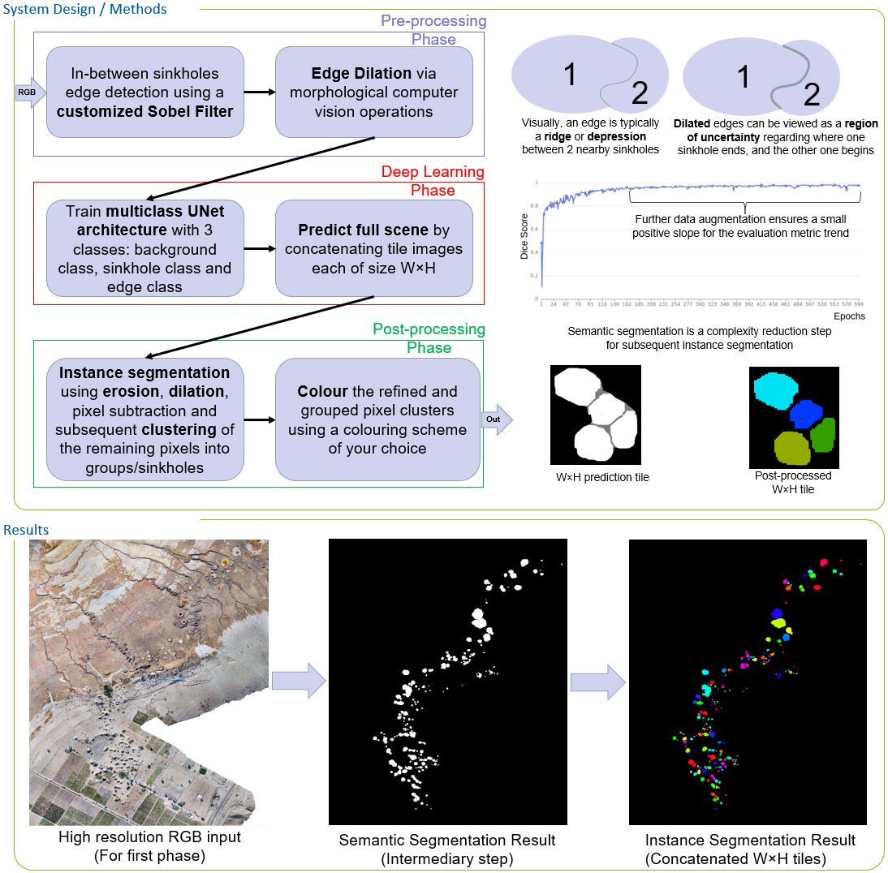

# Geological Structure Segmentation

This repository contains the final code for sinkhole semantic and instance segmentation using drone and satellite data.
The built system is hybrid in nature, i.e. it uses both deep-learning and non-deep-learning computer vision techniques to achieve the final results.

**Many thanks to the following institutions that made this work possible:**
- **German Climate Computing Center (DKRZ), Hamburg, Germany**
- **GEOMAR, Kiel**
- **Helmholtz Center Hereon, Geesthacht, Germany**
- **Helmholtz AI**
- **Leipzig University**

**This work was supported by Helmholtz Association's Initiative and Networking Fund through Helmholtz AI [grant number: ZT-I-PF-5-01].**

**This work used resources of the Deutsches Klimarechenzentrum (DKRZ) granted by its Scientific Steering Committee (WLA) under project ID AIM.**

Our main workflow is as follows: We train the deep learning model to do sinkhole semantic segmentation on the available drone data, and then we use the semantic segmentation maps to create the sinkhole instance segmentation maps via non-deep-learning computer vision techniques. We then do transfer learning of the drone model to satellite data. For this we freeze certain layers in the encoder network and then fine tune the remaining layers using the satellite data. While transfer learning, we again go through the phases of first creating semantic segmentation maps, and then instance segmentation maps.

Before proceeding with the code execution, please create an appropriate environment with the necessary dependencies. Personally, I used 2 environments for the development and running of experiments, so if some of the scripts result in errors, please consider checking the other environment. For more detailed information, I describe both environments separately via: `laptop_requirements.txt` and `server_requirements.txt`, respectively. Please note that these files list third party libraries and dependancies that I use in other projects I work on and that may be therefore irrelevant for this repository in particular.

To create the dataset run `create_drone_instance_segmentation_dataset.py`.

To run the training process execute `deadsea_unet_train.py`. Make sure to select the server or local setup by commenting/uncommenting the `Server`/`Local` parameter sections inside `deadsea_unet_train.py`. The local setup uses a partial dataset to speed-up development.

The experiments can be run with or without Microsoft NNI (Neural Network Intelligence framework). Make sure to set the flag `RUN_WITH_NNI` from `deadsea_unet_train.py` correspondingly, otherwise you will get an error.

Example command for running nni on server:   `nnictl create --config config_server.yaml --port 8080`   or locally:  `nnictl create --config config_local.yaml -- port 8080`. 

The hyperparameters will be searched within the intervals that you specify inside `search_space_local.json` or `search_space_server.json` correspondingly.

After nni finishes the experiments, type `nnictl stop --all` in the command line to close the websocket and other processes in the background.

After training, the best model checkpoint should be used when running `src/predict_full_scene.py` to create the semantic segmentation predictions. The 3-class semantic segmentation map will be stored as `cloudcontainer/drone/saved_full_images/full_semantic_segmentation_prediction_image.jpg`.

To create the instance segmentation map, the `full_semantic_segmentation_prediction_image.jpg` map should be used in conjunction with `src/post_process_full_scene.py`. After running this script, the result will be stored as `cloudcontainer/drone/saved_full_images/full_instance_segmentation_prediction_image.jpg`.

Note that after running `src/deadsea_unet_train.py`, the test result pictures will be saved inside `cloudcontainer/drone/saved_test_demos` and the test metrics will be printed in the console at the end of the training loop as well. However, if you want to test again the best model, or any other checkpoints that were saved during training, you can use the `src/deadsea_unet_test.py` script.

The steps above are for the drone data. Next, we can use the satellite data and go through the following scripts: `src/create_satellite_semantic_segmentation_dataset.py`, `src/transfer_learning_train.py`, `src/transfer_learning_test.py`, `src/satellite_predict_full_scene.py` and finally: `src/satellite_post_process_full_scene.py`. Note that this time, you run `src/transfer_learning_train.py` using plain command-line python, keeping the nni flag, i.e. RUN_WITH_NNI, as False.

The best results where achieved with non-weighted cross-entropy loss. You may also experiment with focal loss. Code is available inside the file `src/focal_loss.py`.
